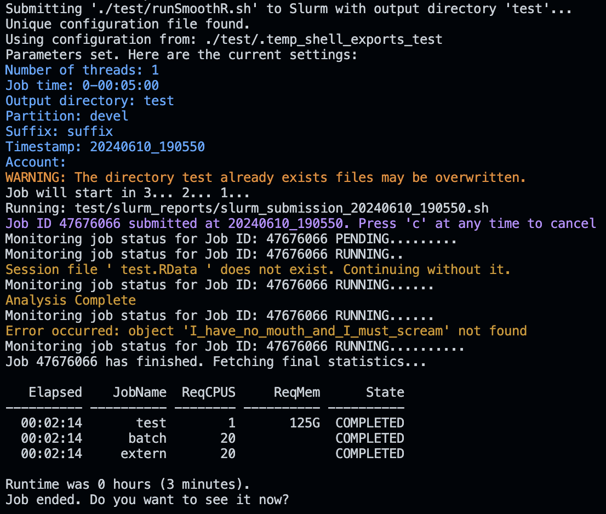

**SmoothR: Simplify Your Slurm Environment Configuration**

SmoothR is a comprehensive R package that simplifies the process of managing and configuring Slurm job environments. With SmoothR, you can easily set up environment variables, manage session states, and seamlessly interact with the Slurm job submission system.

**Installation**

To get started, install SmoothR directly from GitHub using `devtools`:

```r
if (!requireNamespace("devtools", quietly = TRUE)) {
  install.packages("devtools")
}
devtools::install_github("drowsygoat/SmoothR")
```

```
library(SmoothR)
```

# Script Activation

- `InitSmoothR("/path/to/file")`**: Prepares your system to use `runSmoothR.sh`.

# Environment Configuration

- `SetConfig()`: Initializes settings interactively.
- `SetModules()`: Initializes Slurm modules interactively.
- `UpdateConfig(key, value)`: Dynamically updates or adds environment settings.
- `InitNow()`: Executes at job start to load necessary settings.

# Job Management

- `RunNow(script_name=my_script.R)`: Submits the current script to Slurm.
- `RunNow(script_name=my_script.R, lint = TRUE)`: Lints the current script instead.

# Debugging and Management

- `checkpoint()`: Logs progress points within scripts, aiding in debugging.
- `QuitNow()`: Ends a script segment at a specific point.
- `SaveMe()`: Saves current settings for reuse in later Slurm job scripts.

# Interactive Update Functions

- `UpdateNumThreads(NUM_THREADS)`: Configures thread count for parallel processing.
- `UpdateJobTime(JOB_TIME)`: Sets job duration in "D-H:M" format.
- `UpdateOutputDir(OUTPUT_DIR)`: Specifies directory for storing outputs.
- `UpdatePartition(PARTITION)`: Alters the Slurm partition for job queuing.
- `UpdateSuffix(SUFFIX)`: Changes suffix for output file naming.
- `setEmail(email)`: Configures E-mail for SLURM notifications (sets variable).
- `setAccount("snic123")`: Configures user account (sets variable).

# Robust Error Handling

```R
SafeExecute({
  result <- potentiallyFailingFunction()
})

```

```
